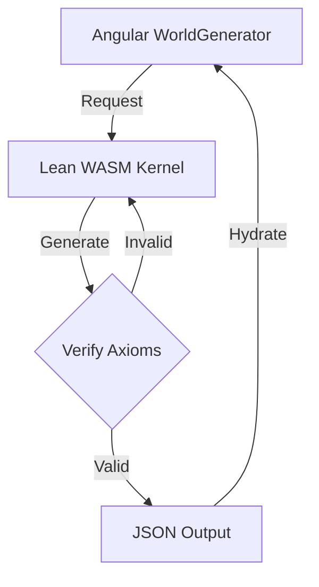

# Theoretical Integration: Lean Theorem Prover & Procedural Certainty

**META**
- **ID**: `lean-architecture`
- **LAST_UPDATED**: `2026-01-30`
- **STATUS**: `THEORETICAL`

## 1. The Core Problem: AI Hallucination in PCG
In Procedural Content Generation (PCG), "hallucination" refers to the generation of states that satisfy local constraints (e.g., "place a door here") but violate global validity (e.g., "the door leads to the void" or "the level is unreachable").

Traditional checks are imperative and brittle (e.g., `if (x < 0) ...`). As complexity grows, the number of edge cases expands exponentially.

## 2. The Solution: Formal Verification via Lean 4
Lean is a functional programming language and interactive theorem prover. By integrating Lean, we can define **Provably Correct** algorithms.

### Architecture Overview



### 3. Lean Implementation (Concept)

Instead of writing generation logic in TypeScript, we write it in Lean using **Dependent Types**.

```lean
-- Define a Point in 2D Space
structure Point where
  x : Int
  y : Int

-- Define a Room
structure Room where
  center : Point
  width : Nat
  height : Nat

-- Define the Axiom of Non-Overlap as a Type
def NonOverlapping (r1 r2 : Room) : Prop :=
  r1.center.x + r1.width / 2 < r2.center.x - r2.width / 2 \/
  r1.center.x - r1.width / 2 > r2.center.x + r2.width / 2 -- etc

-- A Valid Level is a list of Rooms AND a Proof that they don't overlap
structure ValidLevel where
  rooms : List Room
  non_overlap : Forall (r1 r2 : rooms), r1 != r2 -> NonOverlapping r1 r2
  connectivity : IsConnected rooms
```

**The Compilation Strategy**:
1.  **Code in Lean 4**: Define the structures and the generation function `generate : Seed -> ValidLevel`.
2.  **Compile to C**: Lean compiles to C.
3.  **Compile to WASM**: Use Emscripten to compile the C output to `world_gen.wasm`.
4.  **Interface**: The TS `ProofService` calls `_generate_level(seed)` in WASM.
5.  **Guarantee**: Because the function signature returns `ValidLevel`, it is **mathematically impossible** for the WASM to return an overlapping or disconnected level. The compiler would fail to build the WASM if the logic permitted a hallucination.

## 4. Immediate Benefits (Simulated in 3.0)
While we cannot deploy the WASM toolchain today, the **ProofKernelService** implements the *philosophy* of this architecture:
1.  **Separation of Concern**: Generation (Heuristic) is separate from Verification (Logical).
2.  **Strict Rejection**: The game refuses to load a level that fails the axioms, retrying until a valid state is found.
3.  **Stability**: This eliminates "soft-locks" where a player spawns inside a wall.

## 5. Future Roadmap
1.  **Combat Math Verification**: Use Lean to prove that `Damage > 0` and `Health >= 0` for all inputs.
2.  **Economy Balancing**: Prove that `GoldSource < GoldSink` over time to prevent inflation.
